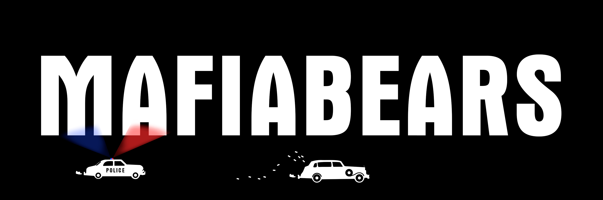

# Welcome to Bear City library

### What Is MafiaBearsPedia?

MafiaBearsPedia is the MafiaBears ecosystem, including all of the components within Mafia Bears that talk to one another: the MafiaBears NFT collection, the gamified and tokenized economy driven by [$HASH](mafiabears/honeycash.md), the leveling system, the Bear Mafia Shares, etc. Over time, we’ll add to and grow MafiaBearsPedia, making the experience for our holders more and more fun, interesting, and rich.

Our aim is to create the most accessible gamified NFT experience; to be a place where having a MafiaBears NFT grants you evolving access to games, tokens, community events, collaborations, and more. We believe we can achieve this goal by continuing to expand the MafiaBear team, bringing on more game developers, artists, and designers.

An integral part of who we are as a brand is our commitment to inclusivity and accessibility. Our most important asset is our community, which prides itself on being welcoming, friendly, funny, and respectful. We support other NFT projects, and we support one another. MafiaBearsPedia is and will continue to be designed to bring that experience to as many people as possible. Whether you’re a MafiaBear holder or not…you’re still a real gangster to us.&#x20;
