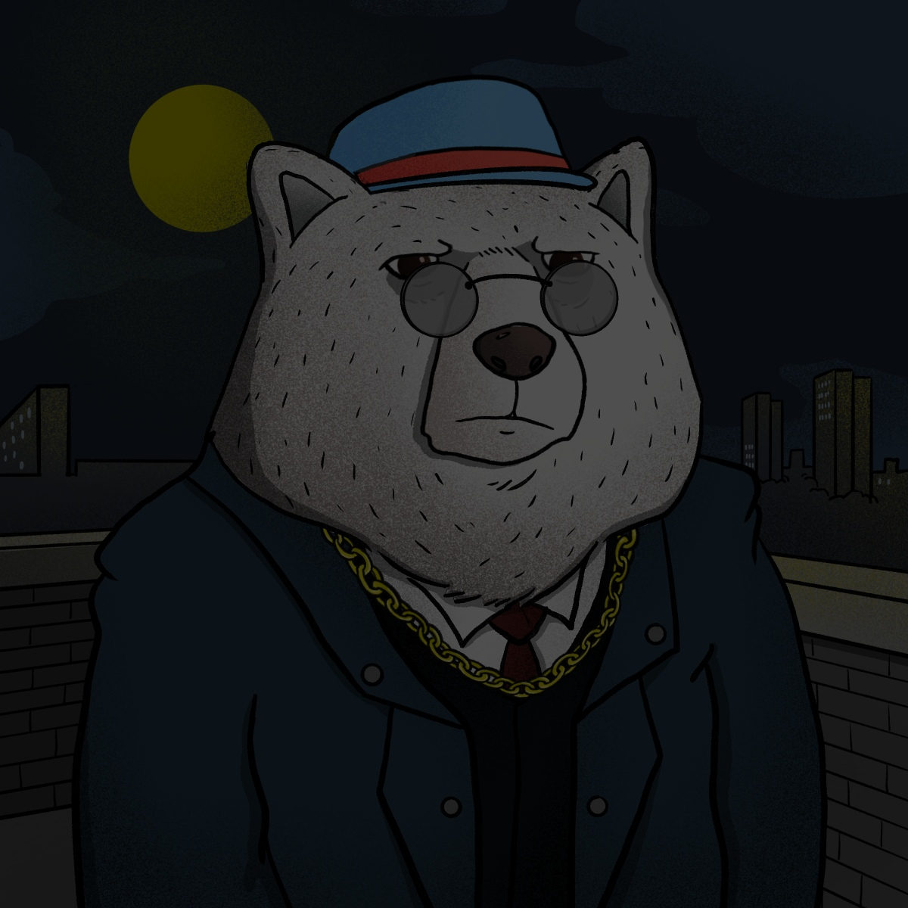

# Assets

**`Accessories`**\
\
23 Accessories that are a rare part of every self-respecting gangster. In bear City, the brighter your chain, the more likely you are to be taken seriously.

**`Hats`**\
\
22 types of hats. A real gangster always wears a hat, but if you suddenly see him without it, he just lost it in a shootout.

**`Costume`**\
\
26 types of costumes. Can you imagine a gangster without a suit? we can't.

**`Background`**\
\
16 locations where you can meet these gangsters. Bear city is divided into districts, and those are divided among themselves by the mafia.

**`Bear Families`**\
\
4 main families who shared the bear city. Powerful, greedy, but damn elegant.

**`Expressions`**\
\
16 Emotions. Bears are not always cold-blooded and restrained, the fear of getting shot or just a good cigar can easily throw them off balance.
