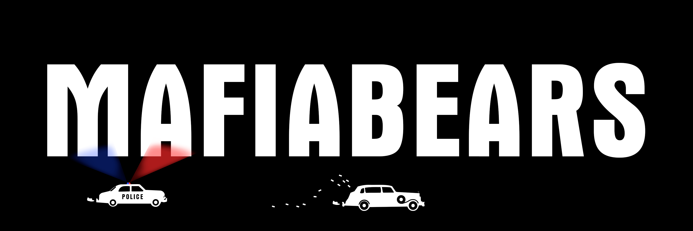

# MafiaBears

MafiaBears is a collection of 9568 bears NFTs - unique digital colletibles living on the Ethereum blockchain. Each bear gives you a passive income of [$HASH](honeycash.md) depending on its level. Future areas and perks can be unlocked by the community through roadmap activation.

# `How do I get a MafiaBear?`

Minting has begun! Minting available on the main website: [https://mafiabears.com/#/](https://mafiabears.com/#/)

# `What can I do with my MafiaBear?`

MafiaBear are a key way [(but not the only way)](broken-reference) to earn [$HASH](honeycash.md), the token that drives MafiaBears economy. If you're a MafiaBear holder, you'll automatically earn [$HASH](honeycash.md) that you can claim daily and use for level up or buy some [$BMS](bms.md)

# `When will reveal be?`

Known Bear faces are top secret for now due to BCPD operation in progress. \
By rumors, this operation should be finished before June 20, 2022.\
Or when all MafiaBears are found (sold out)

