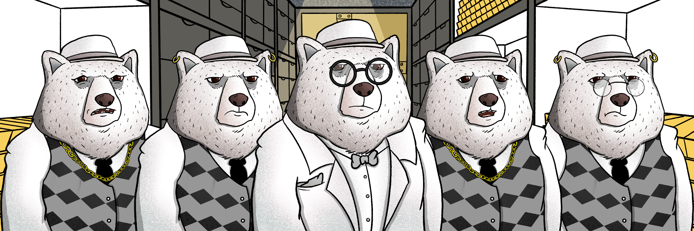

# BearMafiaShares

## What is $BMS?

BearMafiaShares (BMS token) - is ERC20 utility token in BearMafia ecosystem. \
Max supply 500'000'000, Founders premint is 10'000 shares.

Owners of BMS tokens will receive:

* 20% of MB mint revenues as dividends
* 100% of secondary market royalties as dividends
* Voting power (TBD)

## How to become a stakeholder?

Options to purchase:

* With in-game currency for a fixed price of 10 HoneyCash per share (unlimited except max supply)
* With ETH for a fixed price of 0.0001 ETH per share (capped at 100M)
* Secondary markets (Uniswap etc)

## How do I earn $ETH from $BMS?

In the "Shares" tab, click on the "Withdraw Dividends" button
