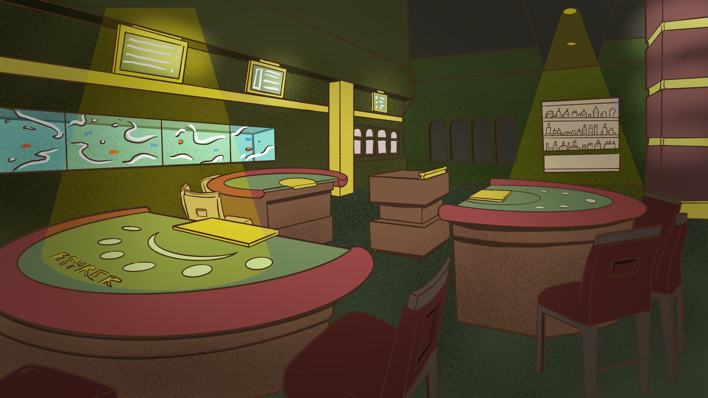

# Families

## Himalayan family

The Himalayan Bear family is generally on good terms with the rest of the major criminal gangs of Bear City. Why do you ask? Their laundry networks are great at helping to launder honey. Our Himalayan enterprising friends rarely resort to forceful solutions to problems, usually they manage to negotiate by simply threatening to terminate business relations. And for good conditions, any family is ready to allocate their thugs to them to solve issues with smaller gangs, of course, for a good discount on their irreplaceable services.

## Panda family

An influential family that takes its roots from the east. In the era of the birth of Bear City, when only honest businessmen bought the first plots and organized their business, pandas had already seized all the drug trafficking in the city. Of course, they depend heavily on their Himalayan partners because their business is the dirtiest in the city. Brown ones often ensure the security of their transactions, and polar friends are always ready to preserve and even increase their assets for a good percentage.

## Polar family

Profitable interest rates? Organization of secure transactions? Anonymity of your deposits? Financial fraud? Oh, yes, these guys know a lot about how to save your money. Cunning, calculating, calm and always courteous. This is how you can describe this probably the richest family in Bear City. Polar bears have always known that the main thing is not how you earn money, but where you keep it. These guys play dirty, but they always fulfill their obligations.

## Brown Bears family

Extortion, murder, racketeering, gambling, pimping, pornography, trade in bears and weapons. This is a small part of what the brown family lives by. Probably the most beaten and inveterate, real gangsters. In truth, the claws and teeth of the criminal world of Bear City. Leave the cunning schemes to the polar bureaucrats, who has the bigger trunk and is right. The Browns think so and have the right to do so. No one ever wants to mess with them. But as soon as problems arise, they always turn to them.

